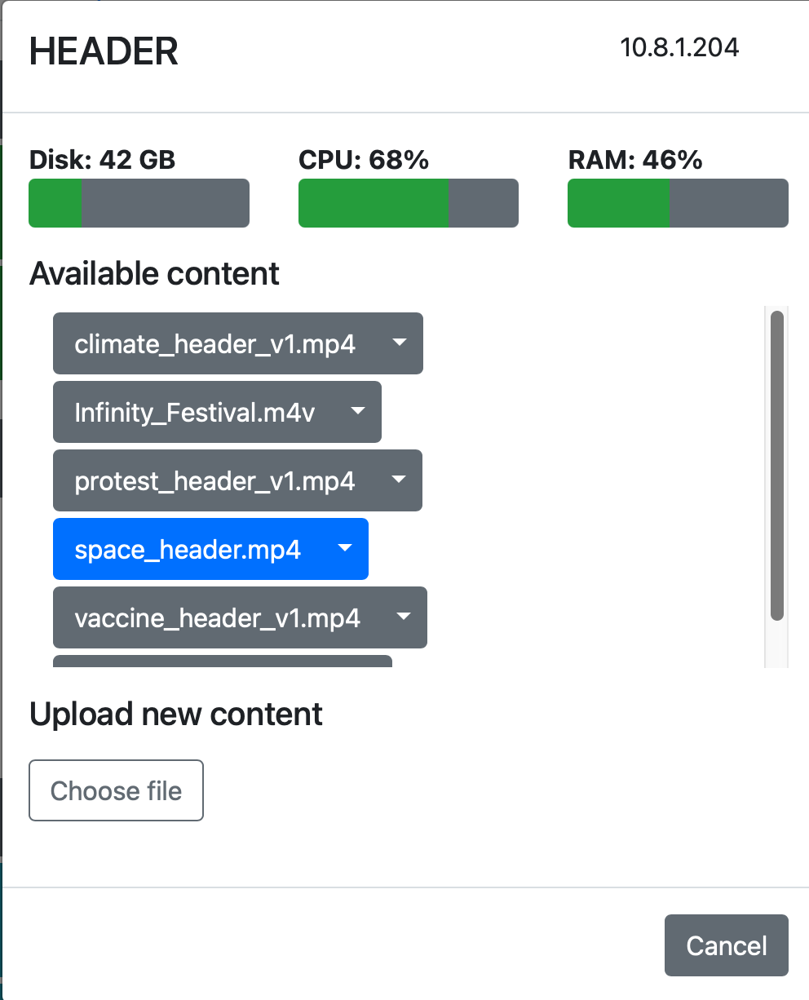

# Control Server

## Introduction

</img>

The control server coordinates communication between **_Constellation_** components and provides a web-based interface for controlling them. The server is implemented in Python 3 and the web console in Javascript.


## Terminology

* `gallery`: A physical space in which `exhibit`s take place.
* `exhibit`: The particular configuration of a `gallery`, including the inclusion or exclusion of specific `component`s and the `content` displayed by each `component`.
* `component`: A single display element within a `gallery`. This could be a projector, a screen, an iPad, or a hands-on mechanical interactive.
* `content`: The information being used by a `component`, such as text, images, video, and local configurations. Content specifies the file(s) on the component machine that should be used.
* `id`: A unique identifier for a given `component`. No two `component`s can have the same `id`.
* `type`: A user-defined grouping of `component`s. For example, if you have multiple screens each displaying similar information, you might assign them all the `type` of "INFO_SCREEN". `type`s allow you to send the same command to multiple devices. Every component must have a `type`.

## Setting up the control server

### Installation

This application requires Python 3.6 or later. To install, follow these steps:

1. Download the files from GitHub and place them somewhere permanent.
2. From a terminal within the directory, run `python3 -m pip install -r requirements.txt` or ensure you have the below requirements satisfied.
3. Edit `currentExhibitConfiguration.ini` to update the required parameters as described [here](#basic-configuration).
4. Run `python3 control_server.py` to start the server
5. To use the web console, open a browser and go to `http://<control_server_ip>:<control_server_port>`.

If you wish to run multiple control servers so you can manage separate galleries independently, you must create a separate directory and instance of the server files for each server you wish to instantiate. Each server will need its own port, but they can all share the same IP address.

#### Required packages

The following packages are required to install the control server. For `pip`, they are listed in `requirements.txt`.

* [`icmplib`](https://github.com/ValentinBELYN/icmplib)
* [`pypjlink2`](https://github.com/benoitlouy/pypjlink)
* [`pywakeonlan`](https://github.com/remcohaszing/pywakeonlan)

### Configuration

#### currentExhibitConfiguration.ini

A `currentExhibitConfiguration.ini` file should be placed in the same directory as `control_server.py`. It contains the basic setup parameters for the server. The delimiter for this INI file is the equals sign (=).

##### Basic configuration
The following keywords are required in your `currentExhibitConfiguration.ini`:

* `server_ip_address`: This is the public IP address of the control server. Note that a static IP address needs to be set at the OS or network level—this value merely records what that address is for distribution to remote clients.
* `server_port`: The port you wish the control server to be accessible at. This port must not already be in use. Make sure that this port is not being blocked by a firewall.
* `current_exhibit`: The name of the current exhibit configuration file in the form of `<name>.exhibit`. Once the control server is initialized, it will automatically adjust the value of this keyword as you change exhibits using the web console.

The following keywords are optional:

* `gallery_name`: The name of the physical space this control server corresponds to, such as "The Smith Dinosaur Hall."
* `reboot_time`: A time (e.g., "3 AM", "23:59") at which the server will be automatically restarted every day. This helps prevent memory leaks and long-term instability, but is not strictly necessary.

##### Scheduling exhibit startup and shutdown

The contorl server can send commands to wake or sleep displays connected to every `component` and `projector` it controls. These are defined in `currentExhibitConfiguration.ini` and the keywords have the form `<day>_on` and `<day>_off`. The value for each keyword should be a time of day. These times can be specified in any common format, such as "2 PM", "2:00 PM", or "14:00". To omit a scheduled action, do not specify the keyword. An example schedule is below:

```
tuesday_on = 9 AM
tuesday_off = 5:00 PM
wednesday_on = 9 am
wednesday_off = 5:00 PM
thursday_on = 9 AM
thursday_off = 5:00 PM
friday_on = 9 AM
friday_off = 8 pm
saturday_on = 9 AM
saturday_off = 17:00
sunday_on = 12 PM
sunday_off = 5 PM
```

The easiest and best way to manage the schedule is through the web console's [Schedule Tab](#schedule-tab).

##### Controlling projectors
The control server can manage projectors over IP using the PJLink protocol or serial commands. Since this happens independently of whatever device is actually connected to the projector, projectors are not considered a `component` and do not have `content`. All projectors are assigned the `type` of "PROJECTOR".

###### PJLink
The PJLink protocol returns a defined set of information about the state of the connected projector. Each manufacturer implements the protocol slightly differently, so the available information may vary marginally.

PJLink projectors are defined in the `[PJLINK_PROJECTORS]` section as such:

```
[PJLINK_PROJECTORS]
myprojector = 10.8.0.177
secureProjector = 10.8.1.235, thePassword
```
Each line defines one projector, in which the keyword becomes the `id`. If a projector has a password for access to PJLink, specify it with a comma after the IP address.

###### Serial (RS-232)
The control server can also manage projectors that implement a serial-over-IP interface. You can also use a wireless serial adapter for projectors that do not implement serial-over-IP. Because every manufacturer implements a different set of functionality, the returned information is much more variable than over PJLink. **If PJLink is available, it is highly recommended.**

PJLink projectors are defined in the `[SERIAL_PROJECTORS]` section as such:

```
[SERIAL_PROJECTORS]
mySerialProjector = 10.8.0.175, barco
myOtherProjector = 10.8.1.234, christie
```

In addition to their IP address, you must specify the manufacturer of your device. Because some manufacturers vary their serial commands over generation, there is no guarantee that the control server supports your model, even if your manufacturer is supported. The following makes are at least partially supported:

| Make      | Known compatible models  |
| ----      | ------------------       |
| Barco     | F35                      |
| Christie  | DHD850-GS, Mirage HD8             |
| Optoma    |                          |
| Viewsonic |                          |

##### Wake on LAN

The control server can send Wake on LAN magic packets to power on machines connected to its network. These devices are specified using the MAC addresses, as such:

```
[WAKE_ON_LAN]
My_PC = B0:C7:30:95:93:C0
MY_PC2 = F1-E3-D1-51-B5-A1, 10.8.0.85
```
If the given machine has a static IP address, you can specify it on the same line, after a comma. The control server will ping that address at intervals to check if the machine is powered on. **To send pings on Windows, you must run the control server with administrator privileges.**

#### Exhibit files
An exhibit file defines the content for a particular exhibit. It is in INI format, with the equals sign (=) as the separator. Each component has its own section. The `content` keyword defines the files that component should use. To specify multiple media pieces, separate them by a comma. For example, the content definition for two displays with `id`s of DISPLAY1 and DISPLAY2 would look like:

```
[DISPLAY1]
content = myvideo.mp4

[DISPLAY2]
content = anImage.jpg, myVideo2.MOV
```

Exhibit files should have the extension `.exhibit`, such as `space.exhibit`.

## Using the web console

The web console is the most convenient way of managing your settings and viewing the state of every `component`. It can be accessed through any modern web browser at the address `http://<control_server_ip>:<control_server_port>`.

### Components tab

The components tab lists every managed `component` and `projector`. Each receives its own tile, which is color-coded by the object's current state.


#### States

The following states apply to both `component`s and `projector`s:

| State   | Component | Projector | Wake on LAN |
| -----   | --------- | --------- | ----------- |
| ACTIVE  | Component is currently being interacted with | - | - |
| ONLINE  | Component is responding | Projector is responding, and powered on | - |
| OFFLINE | Component is not responding | Projector is not responding | WoL system is not responding |
| STANDBY | - | Projector is responding, but powered off | - |
| SYSTEM ON | The computer is on, but no Constellation software is responding. | - | The WoL system is responding to pings |
| WAITING | The component was recently ONLINE. There may only be a temporary connectivity issue.  This is common if a display is sleeping. | - | - |
| UNKONWN | - | - | No IP address was supplied for this WoL system, so we cannot ping it to check its status. |

### Component status page

</img>

Clicking on a `component` opens its status page. Here, you can see a snapshot of the remote system's performance and manipulate its content. The status page is broken into three areas.

#### System status

The system status area, located at the top, provides a summary of the performance of the computer running the `component`. These values are only estimates—if a `component` is behaving inconsistently, use the operating system's tools to diagnose the problem.

Note that CPU usage is not properly reported for `component`s running Windows.

#### Content management

The content management area in the middle allows you to manipulate the displayed `content` for components that support it. It is broken into two tabs: "This exhibit" shows the available `content` loaded for the currently-selected `exhibit`, while "All exhibits" aggregates all `content` available on the `component`. Note that this panel only shows `content` managed by the system helper, including all `content` uploaded through the web console.

`Content` highlighted in blue is in the current display queue, which loops indefinitely. To add or remove a piece of `content`, click it to toggle its color. These changes are not saved until the "Save changes" button is pressed. If you select a file from another `exhibit` (by clicking it in the "All exhibits" tab), that file will be copied to the current `exhibit`.

`Content` can also be deleted from the system using the item's dropdown menu. Note that deleting content takes effect immediately and cannot be undone.

#### Content upload

New `content` can be uploaded using the bottom part of the status page. Click the "Choose file" button and select a file you wish to upload. The uploaded file will be stored as part of the `content` for the currently-running `exhibit`.

Note that uploaded files cannot contain an equals sign (=). If you upload a file with the same filename as a piece of existing `content`, the old file will be overwritten.

### Projector status page

Clicking on a `projector` that is `ONLINE` or `STANDBY` will bring up its status page. Here, you can see an array of information reported by the projector using the PJLink protocol.

### Schedule tab

The schedule tab allows you to modify the power on/power off schedule for the `gallery`. Each day can have one power on and one power off; neither are required.

### Settings tab

#### Reloading currentExhibitConfiguration.ini

If you make a manual change to `currentExhibitConfiguration.ini`, pressing this button will cause the control server to reload it and parse the new configuration as if it were starting up. This means you do not have to stop and restart the server process to make an update.

### Hiding tabs

The Schedule, Settings, and Help tabs can be hidden from view by modifying the URL. For example, to hide the schedule tab, change the URL to read `http://[Your IP]:[Your Port]/webpage.html?hideSchedule`. To hide both the help and settings tabs, use `http://[Your IP]:[Your Port]/webpage.html?hideHelp&hideSettings`.

Hiding tabs can be useful when creating a status console for frontline staff, without showing them the deeper configuration options. **Note that these options can be re-enabled simply by modifying the URL, so this is not a secure method of limiting access.**

## Using the flexible tracker
The `flexible tracker` enables the collection of a wide variety of quantitative and qualitative data using the control server. Collected data is stored as a list of JSON objects, one object per line, in a plain text document on the server.

### Collection types
The tracker can collect a variety of data types. Each type provides a widget that makes inputting the data easy and reliable.

#### Counter
The `counter` records a single integer, which can be increased or decreased in units of 1, much like a traditional "clicker" counter.

#### Dropdown
The `dropdown` records a single value from a user-defined list.

#### Number
The `number` records a single number, including decimals.

#### Slider
The `slider` records a single number, bounded in a user-defined range. The value is selected using a slider.

#### Text
The `text` allows free input of text.

#### Timer
The `timer` records the number of seconds it was running. It can be stopped and started by the user. `timer`s can be exclusive, meaning they stop all other `timer` widgets, or multiple can be used simultaneously.
